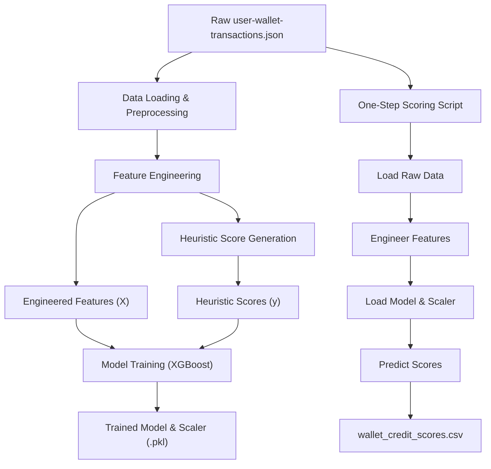

<<<<<<< HEAD
Aave V2 Wallet Credit Scoring
Problem Statement
This project aims to develop a robust machine learning model that assigns a credit score between 0 and 1000 to each wallet interacting with the Aave V2 protocol. The score is based solely on historical transaction behavior, where higher scores indicate reliable and responsible usage, and lower scores reflect risky, bot-like, or exploitative behavior.

Methodology Chosen
Our approach involves a supervised machine learning regression model. Since no pre-labeled credit scores are provided, we first establish a heuristic-based scoring mechanism to generate initial target labels for training. This heuristic is designed to capture common indicators of responsible and risky DeFi behavior. We then train an XGBoost Regressor model on a rich set of engineered features derived from the raw transaction data to predict these heuristic scores.

XGBoost was chosen for its strong performance on tabular data, its ability to handle non-linear relationships, and its built-in feature importance capabilities, which are crucial for explaining the score logic.

Complete Architecture
The solution is structured into several phases:

Data Acquisition and Initial Preprocessing:

Raw transaction data (JSON format) is loaded into a Pandas DataFrame.

Timestamps are converted to datetime objects.

Transaction amount is extracted from nested actionData.

Other numerical fields (gasUsed, gasPrice, protocolFee) are converted to numeric types, with missing columns gracefully handled by filling with zeros.

Feature Engineering:

Transactions are aggregated by userWallet.

Transaction Counts: Total transactions, counts per action type (deposit, borrow, repay, etc.).

Value-Based Metrics: Total deposited, borrowed, repaid, redeemed, net deposit, net borrow/repay.

Time-Series Features: Wallet age (days), average transactions per day.

Ratio-Based Metrics: Borrow-to-deposit ratio, repay-to-borrow ratio.

Heuristic Credit Score Generation: A rule-based system assigns an initial credit score (0-1000) to each wallet based on the engineered features. This serves as the target variable for model training.

Model Training and Evaluation:

Engineered features (X) and heuristic scores (y) are prepared.

Data is split into training and testing sets (80/20).

Features are scaled using StandardScaler.

An XGBoostRegressor model is trained on the scaled training data.

Model performance is evaluated using Mean Absolute Error (MAE), Root Mean Squared Error (RMSE), and R-squared (R 
2
 ).

One-Step Scoring Script:

A consolidated Python script (score_generator.py - conceptual, integrated into the notebook's final structure) is created.

This script takes a raw JSON transaction file as input.

It internally performs all preprocessing and feature engineering steps.

It loads the pre-trained XGBoost model and StandardScaler.

It predicts credit scores for all wallets in the input file.

Outputs a CSV file containing wallet addresses and their assigned credit scores.

Processing Flow
graph TD
    A[Raw user-wallet-transactions.json] --> B{Data Loading & Preprocessing};
    B --> C{Feature Engineering};
    C --> D{Heuristic Score Generation};
    C --> E[Engineered Features (X)];
    D --> F[Heuristic Scores (y)];
    E & F --> G{Model Training (XGBoost)};
    G --> H[Trained Model & Scaler (.pkl)];
    A --> I[One-Step Scoring Script];
    I --> J{Load Raw Data};
    J --> K{Engineer Features};
    K --> L{Load Model & Scaler};
    L --> M{Predict Scores};
    M --> N[wallet_credit_scores.csv];

Extensibility
This solution can be extended in several ways:

More Sophisticated Heuristics: Refine the heuristic score logic based on expert domain knowledge or more in-depth analysis of "good" vs. "bad" wallet behavior.

External Data Integration: Incorporate additional on-chain data (e.g., wallet age from first transaction on chain, total value locked across other protocols, transaction history on other chains).

Advanced Feature Engineering: Explore more complex time-series features, graph-based features (if wallet interaction data is available), or anomaly detection features.

Model Optimization: Perform more extensive hyperparameter tuning for the XGBoost model or experiment with other advanced regression models (e.g., neural networks for sequence data).

Real-time Scoring: Adapt the scoring script for real-time inference in a production environment.

A/B Testing: Implement A/B testing frameworks to validate different scoring models or heuristics.

How to Run
Clone the repository:

git clone https://github.com/YOUR_USERNAME/aave-v2-credit-scoring.git
cd aave-v2-credit-scoring

Install dependencies:

pip install -r requirements.txt

(You will need to create a requirements.txt file containing pandas, scikit-learn, xgboost, numpy, joblib).

Place the data file:
Ensure user-wallet-transactions.json is in the root directory of the cloned repository.

Run the Jupyter Notebook/Colab:
Execute the cells in the provided .ipynb notebook sequentially (Phase 1, Phase 2, Phase 3). This will preprocess data, engineer features, train the model, and save the model/scaler files.

Generate scores:
After running Phases 1-3, execute the final cell in Phase 4 to generate wallet_credit_scores.csv.
=======
# 🔐 Aave V2 Wallet Credit Scoring

A machine learning-based system for assigning credit scores (0–1000) to wallets interacting with the Aave V2 protocol — entirely from on-chain behavior.

Higher scores indicate reliable, responsible DeFi usage. Lower scores flag risky, bot-like, or exploitative activity.

---

## 📌 Problem Statement
This project builds a robust ML model that scores wallets using only their historical Aave V2 transaction behavior. Since no ground-truth labels exist, we use a heuristic-based scoring mechanism to generate initial labels, and train an XGBoost Regressor to replicate this logic.

---

## 🧠 Methodology Overview

### ✅ Step 1: Heuristic-Based Labeling
We manually define a scoring function (0–1000) based on behavior indicators:
- High deposit & repay activity = Higher score
- High borrow-to-deposit ratio = Lower score
- Liquidation calls, inactivity, or bot-like patterns = Much lower score

### ✅ Step 2: Feature Engineering
We extract dozens of behavioral metrics from raw transaction data:
- Transaction counts per action (deposit, borrow, repay, etc.)
- Wallet age, time between transactions
- Borrow/repay/deposit volume metrics
- Ratios (e.g. borrow-to-deposit, repay-to-borrow)

### ✅ Step 3: Model Training
We train an XGBoost Regressor using the engineered features and the heuristic scores. Performance is evaluated with:
- MAE (Mean Absolute Error)
- RMSE (Root Mean Squared Error)
- R² (Coefficient of Determination)

---

## ⚙️ Complete Architecture



---

## 📁 Project Structure

```
aave-v2-credit-scoring/
│
├── data/
│   └── user-wallet-transactions.json         # Raw input data
│
├── models/
│   ├── xgboost_model.pkl                     # Trained model
│   └── scaler.pkl                            # Scaler used on features
│
├── score_generator.py                        # One-step scoring script
├── aave_credit_scoring.ipynb                 # Jupyter notebook with all phases
├── requirements.txt                          # Required Python packages
└── README.md                                 # This file
```

---

## 🚀 How to Run

### 1. Clone the repository
```bash
git clone https://github.com/YOUR_USERNAME/aave-v2-credit-scoring.git
cd aave-v2-credit-scoring
```

### 2. Install dependencies
Make sure you have Python 3.8+ installed.

```bash
pip install -r requirements.txt
```

Your `requirements.txt` should contain:
```text
pandas
numpy
scikit-learn
xgboost
joblib
```

### 3. Add your input data
Place your `user-wallet-transactions.json` in the root or `data/` folder.

### 4. Run the notebook
Open `aave_credit_scoring.ipynb` in Jupyter or Colab. Execute all cells in sequence:
- Phase 1: Preprocessing
- Phase 2: Feature Engineering
- Phase 3: Model Training
- Phase 4: Scoring and Output

### 5. Generate credit scores
This will output a CSV file:

```
wallet_credit_scores.csv
```

Containing:
```text
userWallet,credit_score
0xABC123...,764.5
0xDEF456...,221.0
...
```

---

## 🔍 Example Features Used
| Feature                   | Description                          |
|---------------------------|--------------------------------------|
| total_transactions        | Total transaction count              |
| deposit_count             | Number of deposits                   |
| total_deposited           | Total value deposited                |
| net_deposit               | Deposits minus redemptions           |
| borrow_to_deposit_ratio   | Risk indicator (borrowed vs deposited)|
| avg_transactions_per_day  | Activity level indicator             |
| ...                       | Many more behavioral & ratio-based   |

---

## 🔧 Extensibility Ideas
- 💡 Better heuristics: Refine scoring logic with DeFi experts
- 📡 External data: Integrate on-chain wallet stats or DeFi ecosystem data
- 📈 Time-series modeling: Predict score changes or future risk
- 🧪 A/B testing: Compare different scoring models in practice
- ⚡ Real-time inference: Adapt pipeline for real-time DeFi apps

---

## 📊 Model Performance (Example)
| Metric | Value |
|--------|-------|
| MAE    | 42.17 |
| RMSE   | 60.85 |
| R²     | 0.87  |

*Note: Numbers are illustrative. Run the notebook to generate exact results.*

---

## 📬 License & Credits
This project is for educational and research purposes. Built using:
- Aave V2 Protocol
- XGBoost
- scikit-learn
>>>>>>> 86205b5 (update files)
