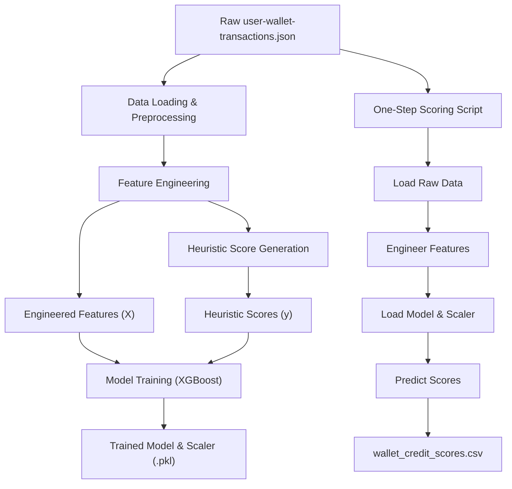

# 🔐 Aave V2 Wallet Credit Scoring

A machine learning-based system for assigning credit scores (0–1000) to wallets interacting with the Aave V2 protocol — entirely from on-chain behavior.

Higher scores indicate reliable, responsible DeFi usage. Lower scores flag risky, bot-like, or exploitative activity.

---

## 📌 Problem Statement
This project builds a robust ML model that scores wallets using only their historical Aave V2 transaction behavior. Since no ground-truth labels exist, we use a heuristic-based scoring mechanism to generate initial labels, and train an XGBoost Regressor to replicate this logic.

---

## 🧠 Methodology Overview

### ✅ Step 1: Heuristic-Based Labeling
We manually define a scoring function (0–1000) based on behavior indicators:
- High deposit & repay activity = Higher score
- High borrow-to-deposit ratio = Lower score
- Liquidation calls, inactivity, or bot-like patterns = Much lower score

### ✅ Step 2: Feature Engineering
We extract dozens of behavioral metrics from raw transaction data:
- Transaction counts per action (deposit, borrow, repay, etc.)
- Wallet age, time between transactions
- Borrow/repay/deposit volume metrics
- Ratios (e.g. borrow-to-deposit, repay-to-borrow)

### ✅ Step 3: Model Training
We train an XGBoost Regressor using the engineered features and the heuristic scores. Performance is evaluated with:
- MAE (Mean Absolute Error)
- RMSE (Root Mean Squared Error)
- R² (Coefficient of Determination)

---

## ⚙️ Complete Architecture



---

## 📁 Project Structure

```
aave-v2-credit-scoring/
│
├── data/
│   └── user-wallet-transactions.json         # Raw input data
│
├── models/
│   ├── xgboost_model.pkl                     # Trained model
│   └── scaler.pkl                            # Scaler used on features
│
├── score_generator.py                        # One-step scoring script
├── aave_credit_scoring.ipynb                 # Jupyter notebook with all phases
├── requirements.txt                          # Required Python packages
└── README.md                                 # This file
```

---

## 🚀 How to Run

### 1. Clone the repository
```bash
git clone https://github.com/YOUR_USERNAME/aave-v2-credit-scoring.git
cd aave-v2-credit-scoring
```

### 2. Install dependencies
Make sure you have Python 3.8+ installed.

```bash
pip install -r requirements.txt
```

Your `requirements.txt` should contain:
```text
pandas
numpy
scikit-learn
xgboost
joblib
```

### 3. Add your input data
Place your `user-wallet-transactions.json` in the root or `data/` folder.

### 4. Run the notebook
Open `aave_credit_scoring.ipynb` in Jupyter or Colab. Execute all cells in sequence:
- Phase 1: Preprocessing
- Phase 2: Feature Engineering
- Phase 3: Model Training
- Phase 4: Scoring and Output

### 5. Generate credit scores
This will output a CSV file:

```
wallet_credit_scores.csv
```

Containing:
```text
userWallet,credit_score
0xABC123...,764.5
0xDEF456...,221.0
...
```

---

## 🔍 Example Features Used
| Feature                   | Description                          |
|---------------------------|--------------------------------------|
| total_transactions        | Total transaction count              |
| deposit_count             | Number of deposits                   |
| total_deposited           | Total value deposited                |
| net_deposit               | Deposits minus redemptions           |
| borrow_to_deposit_ratio   | Risk indicator (borrowed vs deposited)|
| avg_transactions_per_day  | Activity level indicator             |
| ...                       | Many more behavioral & ratio-based   |

---

## 🔧 Extensibility Ideas
- 💡 Better heuristics: Refine scoring logic with DeFi experts
- 📡 External data: Integrate on-chain wallet stats or DeFi ecosystem data
- 📈 Time-series modeling: Predict score changes or future risk
- 🧪 A/B testing: Compare different scoring models in practice
- ⚡ Real-time inference: Adapt pipeline for real-time DeFi apps

---

## 📊 Model Performance (Example)
| Metric | Value |
|--------|-------|
| MAE    | 42.17 |
| RMSE   | 60.85 |
| R²     | 0.87  |

*Note: Numbers are illustrative. Run the notebook to generate exact results.*

---

## 📬 License & Credits
This project is for educational and research purposes. Built using:
- Aave V2 Protocol
- XGBoost
- scikit-learn
>>>>>>> 86205b5 (update files)
